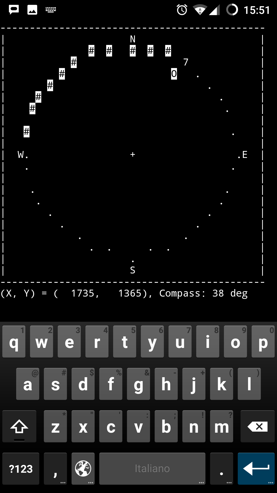
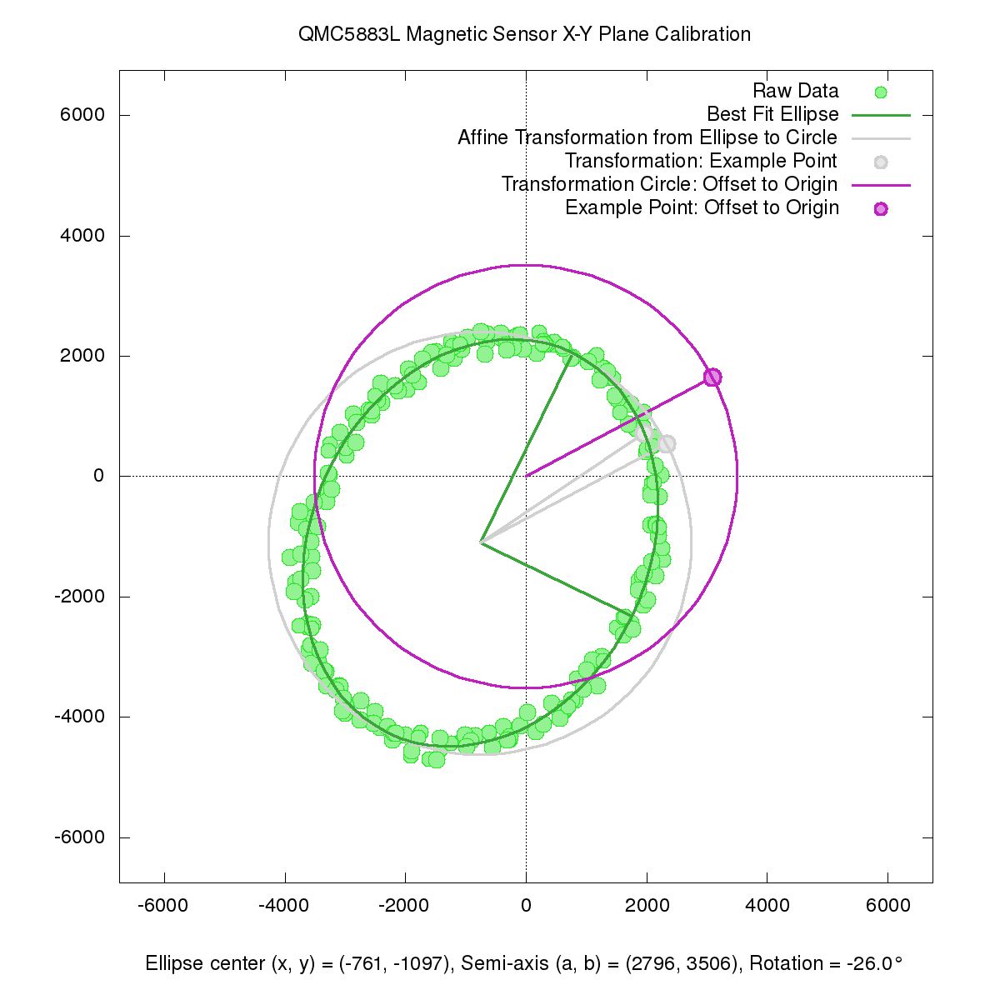

# QMC5883L Magnetic Sensor Calibration

Here we provide some tools that allows a simple calibration of 
the magnetic sensor. Actually there are three magnetic sensors 
in the QMC5883L chip, each one aligned along the three 
orthogonal axes X, Y and Z. In this calibration **we ignore the 
Z axis**, and we let the sensor to work with its X-Y plane 
perfectly aligned to the Earth surface. This will reduce a lot 
the complexity of gathering the required data and the complexity 
of visualizing the calibration data on a graph.

The tools presented here are designed to be run on a **headless 
host** (i.e. without a connected display), using a text-only 
remote connection, whereas the tools aimed to do a full 3D 
calibration, generally require a realtime 3D graphic animation.

## Gathering data with 2d-calibration-get-samples



First of all we need to execute the 
**2d-calibration-get-samples** script. It runs doing a 
continuous read of the magnetic sensor and saving several data 
points all along the circumference. You need to turn the sensor 
all way round and wait for the counter to increment for each one 
of the 36 sectors, untill it became an hash **#** sign.

In an ideal world (no misalignment of the sensor, sensor 
sensitivity perfectly simmetric, no deformation of the Earth 
magnetif field) the acquired points **should align perfectly 
onto a circumference**, centered on the axes origin. More 
likely, the points **will align onto an ellipse with the center 
having some offset** from the axes origin.

When a sufficient number of points are acquired (or when the "Q" 
key is pressed, the script will save the gathered data to a file 
and exit. The data file will be named
**magnet-data\_YYYYmmdd\_HHMM.txt**.

## Executing 2d-calibration-make-calc



This second script will calculate the **geometric 
transformation** required to transform the decentered ellipse 
into a perfectly centered circle.

The result will be a **3x3 matrix** of floating point numbers, 
that the qmc5883l driver can use to provide a calibrated value 
for the **get\_bearing()** function.

Another result will be a **Gnuplot script** which can be used to 
visualize the acquired points and the geometric transformation 
calculated.

In details, the Python script will:

1. Calculate the **ellipse that best fits the data**, using the 
least squares method.
2. Calculate the **affine transformation matrix** from the 
ellipse to the circle with the radius equal to the ellipse major 
axis.
3. Output a **Gnuplot script** which generates a graph with:
   * the input data points;
   * the fitting ellipse;
   * the affine transformation circle;
   * the position of an example point before and after the transformation;
   * the affine transformation circle, centered at the origin;

The commands to be executed from the command line are something 
like:

```
2d-calibration-get-samples
2d-calibration-make-calc magnet-data_20181018_1711.txt > gnuplot-script
gnuplot gnuplot-script
```
